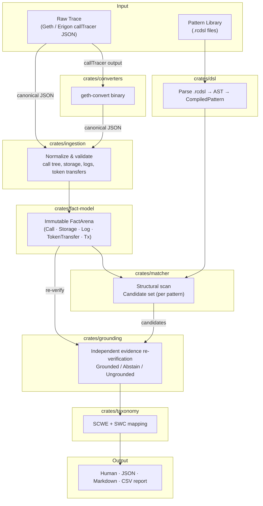
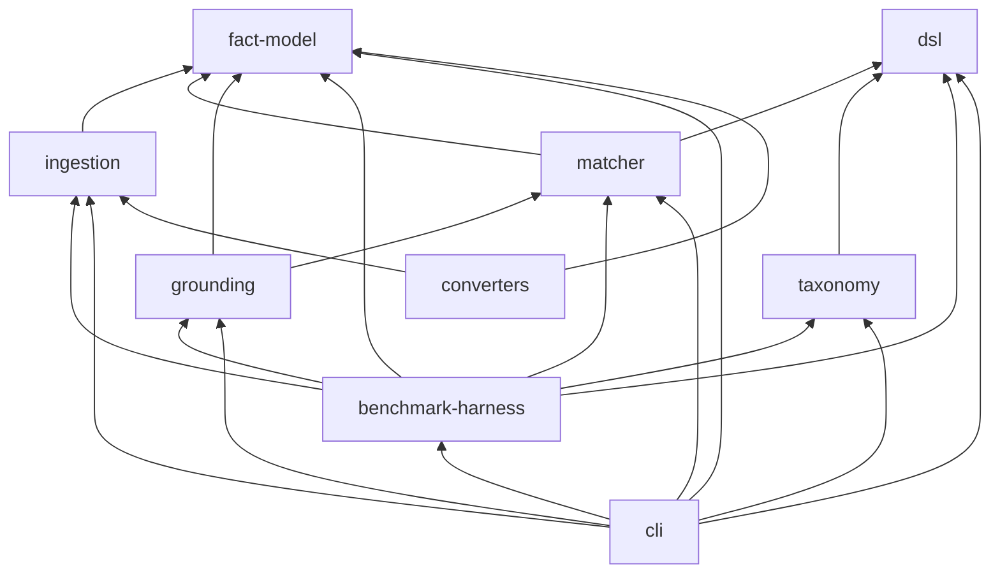

# Root Cause

> Deterministic, evidence-grounded EVM exploit pattern detection — no ML, no confidence scores, no guessing.

[](https://github.com/t0k1t00/Rootcause/actions/workflows/ci.yml)
[](https://www.rust-lang.org)

Root Cause takes a raw EVM transaction trace and a library of pattern definitions written in its own DSL, and tells you — with independently verified, clause-by-clause evidence — whether a known exploit shape is structurally present.

---

## Table of Contents

- [How It Works](#how-it-works)
- [Architecture](#architecture)
- [Workspace Layout](#workspace-layout)
- [Installation](#installation)
- [Quick Start](#quick-start)
- [Pattern Authoring](#pattern-authoring)
- [Pattern DSL Reference](#pattern-dsl-reference)
- [Detection Pattern Library](#detection-pattern-library)
- [Trace Format Converters](#trace-format-converters)
- [Exploit Corpus](#exploit-corpus)
- [CI Pipeline](#ci-pipeline)
- [Docker](#docker)
- [Troubleshooting](#troubleshooting)

---

## How It Works

Root Cause runs a four-stage pipeline against a canonical trace and a set of `.rcdsl` pattern files:

1. **Ingest** — Parse the raw trace into an immutable fact model: calls, storage changes, log events, token transfers, and transaction metadata.
2. **Match** — Structurally scan every pattern against the fact model, producing a candidate set per pattern.
3. **Ground** — Independently re-derive, clause by clause, whether the trace supports each candidate. Results are `Grounded`, `Abstain`, or `Ungrounded` — never a confidence score.
4. **Taxonomize** — Map every result onto external vulnerability registries: [SCWE](https://scs.owasp.org/SCWE/) (primary) and [SWC](https://swcregistry.io/).

**Precision over recall.** A pattern that cannot be independently confirmed abstains rather than guessing. Abstention is a first-class outcome, not a silent failure.

---

## Architecture



### Crate dependency graph



---

## Workspace Layout

```
rootcause/
├── crates/
│   ├── fact-model/          Canonical, immutable trace representation
│   ├── ingestion/           Normalize raw trace JSON → FactArena
│   ├── dsl/                 Pattern Definition Language: parse → AST → IR
│   ├── matcher/             Deterministic structural pattern matching engine
│   ├── grounding/           Independent evidence re-verification + abstention
│   ├── taxonomy/            SCWE-primary + SWC vulnerability taxonomy mappings
│   ├── benchmark-harness/   Precision/recall/F1 evaluation harness
│   ├── cli/                 rootcause binary — all user-facing subcommands
│   └── converters/          geth-convert binary — Geth/Erigon trace adapter
├── integration-tests/       Cross-crate binary-level integration tests
├── patterns/                Detection pattern library (.rcdsl)
├── demo/                    Curated exploit trace corpus (JSON)
│   └── samples/             Real callTracer responses for converter tests
├── examples/                Annotated example patterns with walkthrough
├── docs/
│   ├── PATTERN_AUTHORING_GUIDE.md
│   ├── spec/                Architecture + engineering specification
│   └── adr/                 Architecture Decision Records
├── .github/workflows/ci.yml
├── Dockerfile
├── docker-compose.yml
└── rust-toolchain.toml      Pinned to 1.87.0
```

---

## Installation

### Build from source

```sh
git clone https://github.com/t0k1t00/Rootcause
cd Rootcause
cargo build --release -p cli
./target/release/rootcause --version
```

Requires the pinned Rust 1.87.0 toolchain. `rustup` reads `rust-toolchain.toml` automatically — no additional runtime dependencies.

### Docker

```sh
docker build -t rootcause .
docker run --rm -v "$(pwd)/demo:/data:ro" rootcause \
    analyze /data/dao.json --patterns /patterns
```

### Shell completions

```sh
rootcause completions bash        # bash
rootcause completions zsh         # zsh
rootcause completions fish        # fish
rootcause completions powershell  # PowerShell
```

---

## Quick Start

```sh
cargo run -p cli -- analyze demo/dao.json --patterns patterns/
```

Expected output:

```
Trace: demo/dao.json
  transaction 0xbbbb...bbbb (block 238002, chain 1)
  3 call(s), 1 storage change(s), 0 log(s), 0 token transfer(s)

Ran 7 pattern(s), found 1 candidate match(es), 1 finding(s) after grounding:

[GROUNDED] classic_reentrancy v1 (Reentrancy, Critical)
  candidate: f803b1b939c2d12a
  required evidence: 2/2 verified; optional: 0/0 verified
  taxonomy:
    - SCWE SCWE-046: Reentrancy Attacks
    - SWC  SWC-107:  Reentrancy
```

`GROUNDED` means both evidence clauses were independently re-derived from the actual call structure.

```sh
# JSON output
cargo run -p cli -- analyze demo/dao.json --patterns patterns/ --format json

# Markdown
cargo run -p cli -- analyze demo/dao.json --patterns patterns/ --format markdown

# Benchmark
cargo run -p cli -- benchmark \
    crates/benchmark-harness/tests/fixtures/reentrancy_basic/case.json \
    --format markdown
```

---

## Pattern Authoring

Root Cause ships a pattern SDK — four subcommands that streamline writing and validating `.rcdsl` detection patterns:

```sh
# 1. Scaffold a starter pattern with demo trace pair and README template
rootcause new-pattern my_pattern --family MyExploitFamily

# 2. Edit patterns/my_pattern.rcdsl and the demo trace pair
#    See docs/PATTERN_AUTHORING_GUIDE.md

# 3. Validate: syntax → metadata → compilation → taxonomy → demo-trace checks
rootcause validate-pattern patterns/my_pattern.rcdsl

# 4. Canonically format
rootcause format-pattern patterns/my_pattern.rcdsl --write

# 5. Scan the whole library for cross-file issues
rootcause doctor
```

See [`docs/PATTERN_AUTHORING_GUIDE.md`](docs/PATTERN_AUTHORING_GUIDE.md) for the full authoring guide.

---

## Pattern DSL Reference

Patterns are written in `.rcdsl` files. A minimal example:

```
pattern classic_reentrancy version 1 {
    family:   Reentrancy
    severity: Critical

    evidence {
        required reentrant_call: call(
            kind:      External,
            reentrant: true,
            value_out: true
        )
        required post_write: storage(
            changed:   true,
            call_kind: External
        )
    }

    sequence:   [reentrant_call, post_write]
    constraint: reentrant_call
}
```

### Evidence predicate kinds

| Predicate | Key attributes |
|-----------|----------------|
| `call(...)` | `kind`, `selector`, `succeeded`, `reentrant`, `value_out`, `parent_kind`, `ancestor_kind` |
| `storage(...)` | `slot`, `changed`, `call_kind` |
| `log(...)` | `topic0`, `decoded` |
| `token_transfer(...)` | `direction`, `token` |
| `value_flow(...)` | `direction`, `min`, `max` |
| `transaction(...)` | `status`, `min_gas`, `max_gas` |

### Cross-evidence correlation

| Section | Purpose |
|---------|---------|
| `sequence: [a, b, ...]` | Clauses must appear in non-decreasing trace order |
| `same_call: [a, b, ...]` | All listed clauses must originate from the identical call |
| `constraint: expr` | Logical predicate over evidence names |

### Grounding outcomes

| Status | Meaning |
|--------|---------|
| `Grounded` | All required evidence clauses independently re-verified |
| `Abstain` | Structural match found, but ≥1 clause is unresolvable from the fact model |
| `Ungrounded` | Evidence clause re-verification failed |

---

## Detection Pattern Library

Eight patterns ship in `patterns/`, each exercised by the integration test suite:

| Pattern | Family | Severity | SCWE | SWC |
|---------|--------|----------|------|-----|
| `classic_reentrancy` | Reentrancy | Critical | SCWE-046 | SWC-107 |
| `unchecked_external_call` | UncheckedExternalCall | High | SCWE-048 | SWC-104 |
| `delegatecall_storage_collision` | DelegatecallStorageCollision | Critical | SCWE-150 | SWC-112 |
| `unsafe_selfdestruct` | UnsafeSelfdestruct | Critical | SCWE-050 | SWC-106 |
| `delegatecall_reachable_selfdestruct` | DelegatecallReachableSelfdestruct | Critical | SCWE-038 | SWC-106 |
| `delegatecall_reachable_selfdestruct_transitive` | DelegatecallReachableSelfdestruct | Critical | SCWE-038 | SWC-106 |
| `spoofed_transfer_event` | SpoofedTransferEvent | High | SCWE-063 | — |
| `oracle_manipulation` | OracleManipulation | High | SCWE-028 | — |

> `oracle_manipulation` abstains by design — its `role: PriceOracle` attribute is unresolvable from call-graph traces alone.

---

## Trace Format Converters

`crates/converters` adapts Ethereum tooling output into Root Cause's canonical schema. Converters are pure functions with no network I/O.

### Geth / Erigon `debug_traceTransaction` callTracer

```sh
cargo run -p converters --bin geth-convert -- \
    --input    demo/samples/geth_calltracer_goerli.json \
    --tx-hash  0xc0ffcf21dc1881c3f20160b530d76f1d37af7b40552f7c59d3f339bad3023dad \
    --block    0x876123 \
    --chain-id 0x5 \
    --nonce    0x1 \
    --output   demo/converted/geth_goerli.json

cargo run -p cli -- analyze demo/converted/geth_goerli.json --patterns patterns/
```

The same binary handles both Geth and Erigon — their `callTracer` formats are structurally identical. Verified against real traces from both clients in the integration test suite.

---

## Exploit Corpus

Every row is backed by an integration test in `integration-tests/tests/exploit_corpus.rs` that runs the real `rootcause` binary and asserts on its output.

| Trace | Pattern | Outcome |
|-------|---------|---------|
| `demo/dao.json` | `classic_reentrancy` | ✅ `GROUNDED` — Critical, SWC-107/SCWE-046 |
| `demo/cross_function_reentrancy.json` | `classic_reentrancy` | ✅ `GROUNDED` — Critical |
| `demo/reentrancy_safe.json` | `classic_reentrancy` | ✅ `0 matches` |
| `demo/oracle_manipulation.json` | `oracle_manipulation` | ✅ `ABSTAIN` — by design |
| `demo/unchecked_call.json` | `unchecked_external_call` | ✅ `GROUNDED` — High, SWC-104/SCWE-048 |
| `demo/checked_call_reverts.json` | `unchecked_external_call` | ✅ `0 matches` |
| `demo/delegatecall_storage_collision.json` | `delegatecall_storage_collision` | ✅ `GROUNDED` — Critical, SWC-112/SCWE-150 |
| `demo/delegatecall_storage_safe.json` | `delegatecall_storage_collision` | ✅ `0 matches` |
| `demo/delegatecall_storage_adjacent_not_producing.json` | `delegatecall_storage_collision` | ✅ `0 matches` |
| `demo/unsafe_selfdestruct.json` | `unsafe_selfdestruct` | ✅ `GROUNDED` — Critical, SWC-106/SCWE-050 |
| `demo/selfdestruct_reverted.json` | `unsafe_selfdestruct` | ✅ `0 matches` |
| `demo/delegatecall_reachable_selfdestruct.json` | `delegatecall_reachable_selfdestruct` | ✅ `GROUNDED` — Critical, SWC-106/SCWE-038 |
| `demo/selfdestruct_direct_call_not_delegated.json` | `delegatecall_reachable_selfdestruct` | ✅ `0 matches` |
| `demo/delegatecall_reachable_selfdestruct_transitive.json` | `delegatecall_reachable_selfdestruct_transitive` | ✅ `GROUNDED` — Critical |
| `demo/selfdestruct_delegatecall_sibling_not_ancestor.json` | `delegatecall_reachable_selfdestruct_transitive` | ✅ `0 matches` |
| `demo/spoofed_transfer_event.json` | `spoofed_transfer_event` | ✅ `GROUNDED` — High, SCWE-063 |
| `demo/real_transfer_event.json` | `spoofed_transfer_event` | ✅ `0 matches` |

---

## CI Pipeline

Every push to `main` runs six jobs:

| Job | Command | Fails CI? |
|-----|---------|-----------|
| `fmt` | `cargo fmt --all --check` | Yes |
| `clippy` | `cargo clippy --workspace --all-targets -- -D warnings` | Yes |
| `test` | `cargo build --workspace && cargo test --workspace` | Yes |
| `doc` | `cargo doc --workspace --no-deps` (`RUSTDOCFLAGS=-D warnings`) | Yes |
| `deny` | `cargo deny check` | Yes |
| `coverage` | `cargo llvm-cov` → `lcov.info` artifact | No |

---

## Docker

```sh
# Build
docker build -t rootcause .

# Analyze a trace
docker run --rm \
    -v "$(pwd)/demo:/data:ro" \
    rootcause analyze /data/dao.json --patterns /patterns

# Docker Compose
docker compose run rootcause analyze /data/dao.json --patterns /patterns
```

The image bundles the pattern library at `/patterns`. Mount a custom directory as an additional volume to use your own patterns.

---

## Troubleshooting

| Symptom | Likely cause | Fix |
|---------|-------------|-----|
| `error: failed to load trace input` | Wrong trace path | First positional argument is always the trace file |
| `error: failed to read --patterns` | `--patterns` needs a `.rcdsl` file or directory (not nested) | Check path |
| `benchmark` reports `0 cases run` | Directory mode is non-recursive | Place `.json` case files directly in the suite dir |
| `0 candidate match(es)` unexpectedly | Missing evidence data in trace (e.g. `callTracer` with no storage/log) | Run `rootcause analyze ... --verbose` for per-stage diagnostics |
| Finding shows `[ABSTAIN]` | Evidence clause structurally unresolvable — correct behaviour | See pattern's doc comment in `patterns/*.rcdsl` |
| Docker build fails fetching dependencies | Network required for `cargo build` | Expected — the runtime binary makes no network calls |
